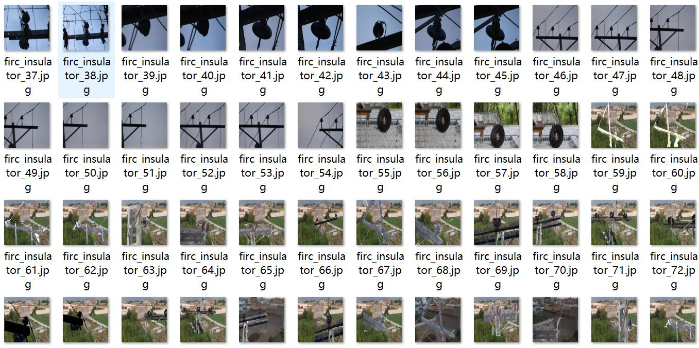
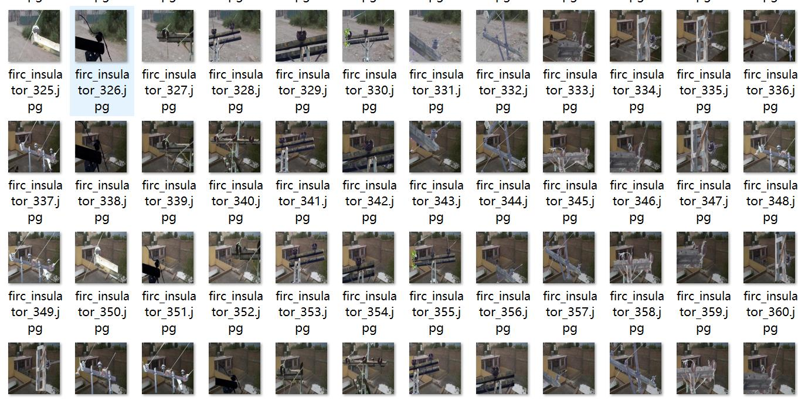
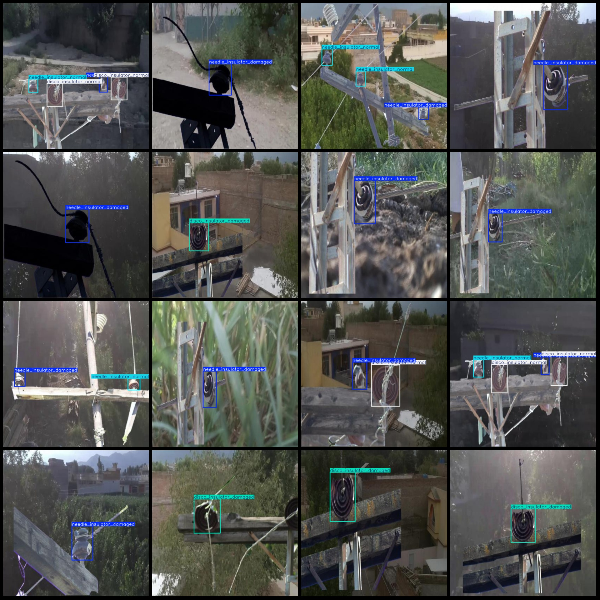
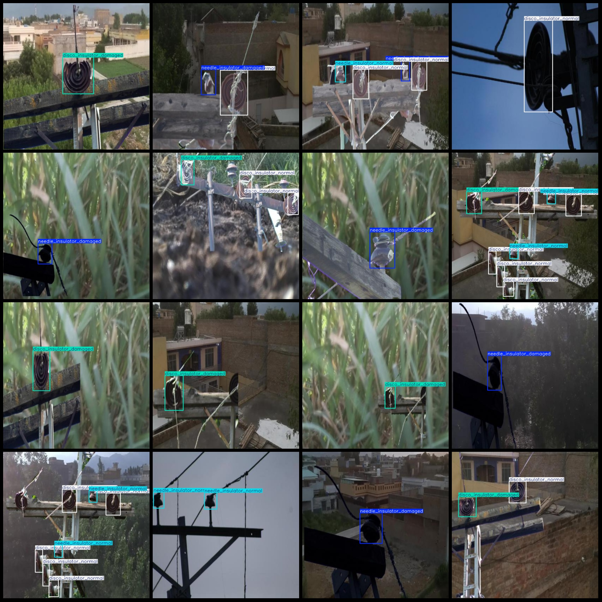

# Optical Disk Insulator and Wire Insulator Flaw Detection Dataset in VOC+YOLO Format with 901 Images of 4 Categories

Please pay attention to the fact that most images in the dataset are formed through paste enhancement. Due to the lack of defective images, we have used an enhanced image method. Please carefully examine the image conditions before purchasing.
Dataset format: Pascal VOC format+YOLO format (do not include split path in txtfile, only contain jpgimage and corresponding VOC format xmlfile and yolo format txtfile)
number of images: 901  
annotation count: 901  
annotation count: 901  
annotationnumber of classes: 4  
Annotation class names: ["disco_insulator_damaged", "disco_insulator_normal", "needle_insulator_damaged", "needle_insulator_normal"]
boxes per class:   
disco_insulator_damaged box count = 397
disco_insulator_normal box count = 810
needle_insulator_damaged box count = 441
needle_insulator_normal box count = 345
total boxes: 1993  
image resolution: 640x640  
Use annotation tool: labelImg
Annotation rule: draw a rectangle around the class.
Important notes: There are no special statements at this time.
Special statement: This dataset does not guarantee the accuracy of the trained model or weight file.
image preview:
## Images

Here is a pay link on Stripe ( https://buy.stripe.com/3cs8yP7sY87d0vu9AB ). Please contact me lonlonago@foxmail.com after funding $89, and I will send you a complete data files , thank you!

